# RPSLS

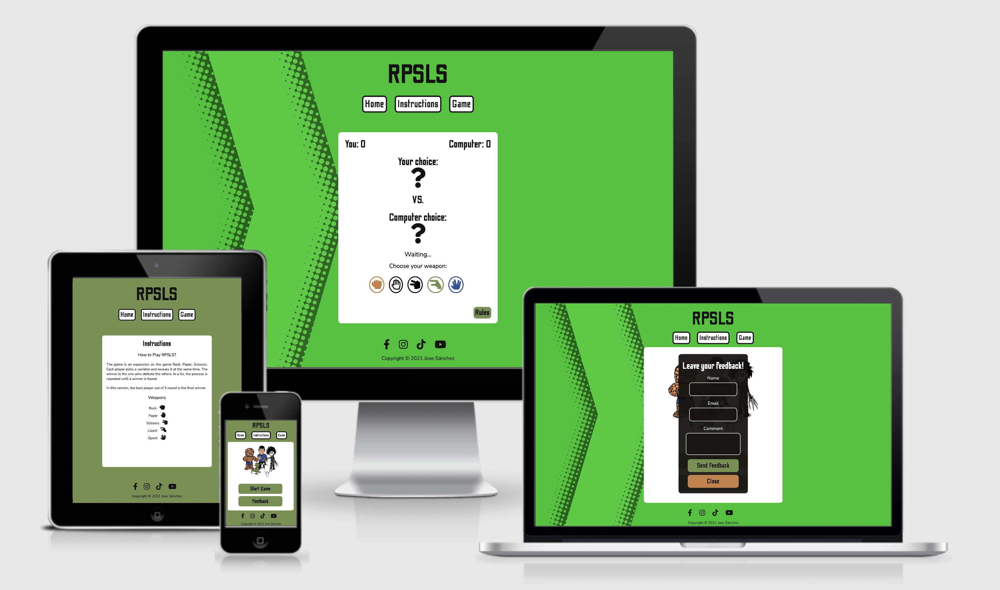

Rock Paper Scissors Lizard Spock (RPSLS) is an extension of the classic game of chance, Rock Paper Scissors, created by Sam Kass and Karen Bryla. This variant was mentioned in a 2005 article in *The Times* of London and was later the subject of an episode of the American sitcom *The Big Bang Theory* in 2008.

This website is created to have fun playing this game against the computer. The game is entirely based on chance and the website is easy to navigate in order to easily find the rules, the game area and the feedback form in case the user wants to leave any comments.

Visit the deployed website [here](https://josswe26.github.io/rpsls/).

## Table of Contents

1. [User Experience (UX)](#user-experience-UX)
    1. [Project Goals](#project-goals)
    2. [User Stories](#user-stories)
    3. [Color Scheme](#color-scheme)
    4. [Typography](#typography)
    5. [Wireframes](#wireframes)
2. [Features](#features)
    1. [General](#general)
    2. [Home Section](#home-section)
    3. [Instructions Section](#instructions-section)
    4. [Game section](#game-section)
    5. [Result Section](#result-section)
    6. [404 Error Page](#404-error-page)
3. [Technologies Used](#technologies-used)
    1. [Languages Used](#languages-used)
    2. [Frameworks, Libraries and Programs Used](#frameworks-libraries-and-programs-used)
4. [Testing](#testing)
    1. [Testing User Stories](#testing-user-stories)
    2. [Code Validation](#code-validation)
    3. [Accessibility](#accessibility)
    4. [Tools Testing](#tools-testing)
    5. [Manual Testing](#manual-testing)
5. [Finished Product](#finished-product)
6. [Deployment](#deployment)
    1. [GitHub Pages](#github-pages)
7. [Credits](#credits)
    1. [Content](#content)
    2. [Media](#media)
    3. [Code](#code)
8. [Acknowledgements](#acknowledgements)

***

## User Experience (UX)

### Project Goals

* The website provides a structure easy to understand and navigate.

* Contains fun colors and interactivity to engage the player in the game play.

* Responsive design to make the game accessible on different devices.

* Incorporates a rules section that is easily accessible to the player.

* A feedback section is provided to get comments from the player in order to further develop the website.

### User Stories

* As a player, I want the game's website to be easy to navigate.

* As a player, I want the game to be fun and engaging.

* As a player, I want to have easy access to the game rules.

* As a player, I want the game controls to be easy to access during the game.

* As a player, I want to receive overall feedback during and after the game.

* As a player, I want to be able to play the game on different devices.

### Color Scheme

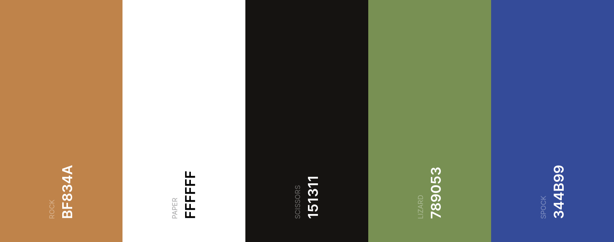

The colors used in the site are white (#ffffff) for the navigation bar, slides background and some hover effects, a tone of orange (#bf834a) for closing buttons and buttons' hover effect, a tone of green (#789053) for the background and buttons, a blue color (#344b99) and a dark color (#151311) for the text.

The colors scheme is inspired on the game's main image. This way each color represents the 5 different weapons (rock, paper, scissors, lizard and Spock) used in the game.

### Typography

The main font used in the site is Nunito, as suggested by Google Fonts for appropriate pairings with Odibee Sans, with Sans Serif as the fallback font in case Nunito is not being imported correctly. Odibee Sans is used for the headings and the logo for the gaming design it provides with Cursive as fallback.

### Wireframes

[Balsamiq](https://balsamiq.com/) has been used to showcase the appearance of the site and display the placement of the different elements whitin the pages.

Page | Wireframe
--- | ---
Home section | 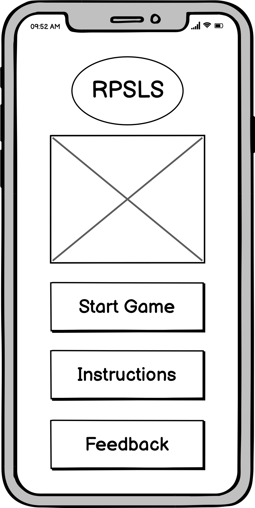
Instructions section | 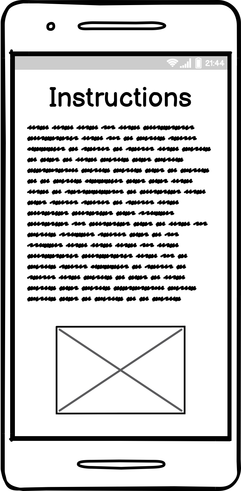
Game section| 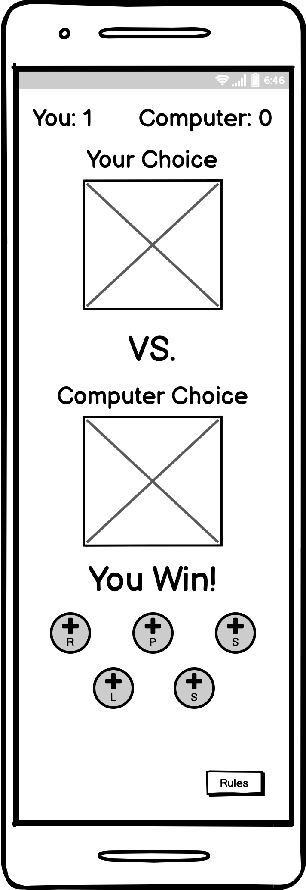
Feedback | 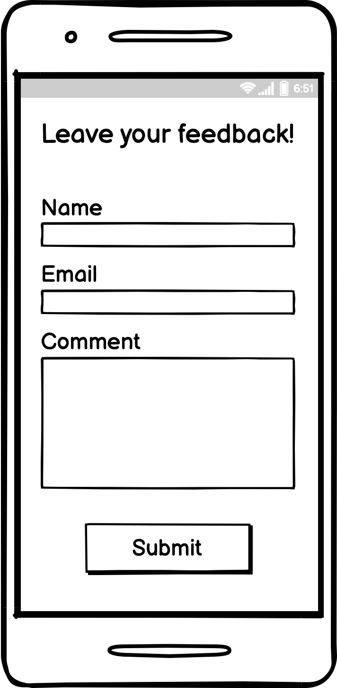
Rules | 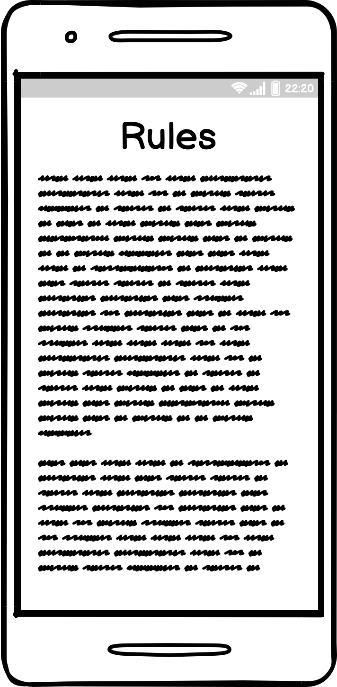

[Back to top ⇧](#rpsls)

## Features

### General

* The website has been designed from a mobile first perspective.

* Responsive design across all device sizes.

* **Header**
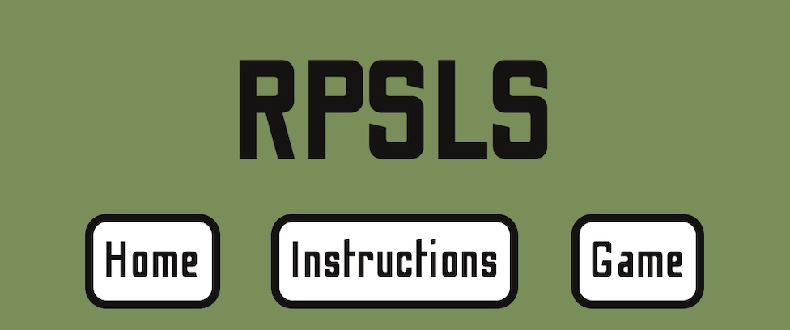

    - The header contains the main logo and a navigation bar positioned on top of the main content.

    - The navigation bar contains links to all sections to facilitate navigation across the site. It also has a hover effect that changes color to provide feedback to the player for a better user experience.

* **Carousel**

- A carousel design has been chosen to present the site content in order give more interactivity to the site and make it easy to navigate between the different sections.

* **Footer**

    - The footer include links to the site's social media channels.

* **Background**
    - A video background has been added to devices with screens 1024px wide and up to add some animation to large displays.

* **Landscape Orientation Blocker**
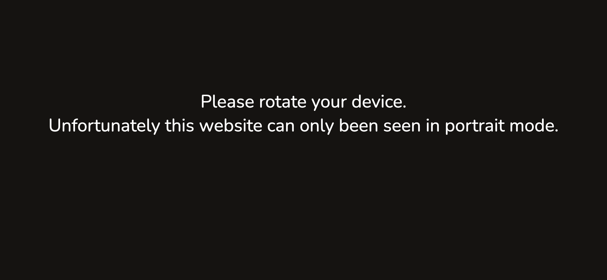

    - When the player turns the device to landscape mode, the site show a full screen section to inform the user to use the site on portrait mode.

### Home Section
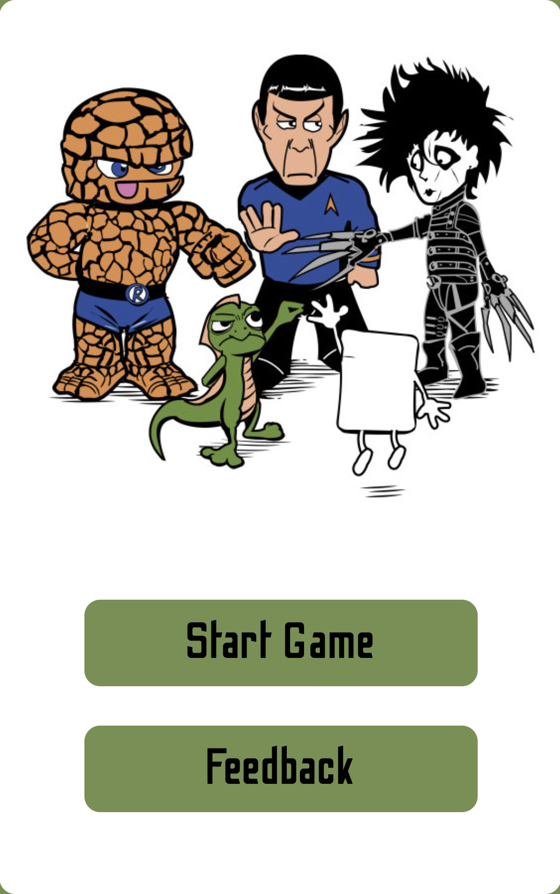

* **Main Image**
    - The main image has been selected to represent the game in a fun way in order to engage the player.

* **Main Buttons**
    - The start game button work as a link to the game section.

    - The feedback button open the feedback popup.

* **Feedback Form Popup**

- Provide the player a popup form accessible from the home section to be able to submit their feedback.

### Instructions Section
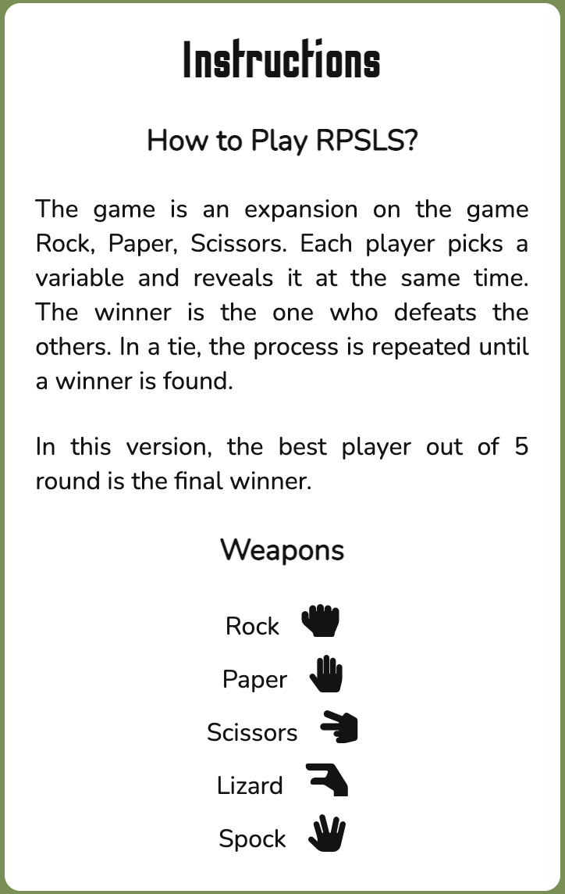

* The instructions section provides information to the player on how to play the game and present the weapons available in the game.

### Game section
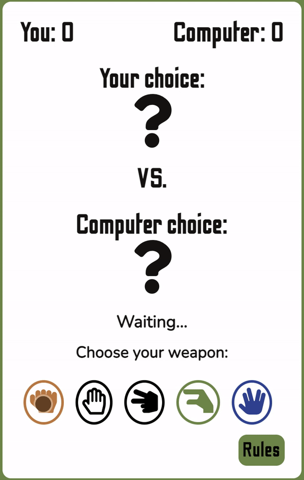

* **Score Area**
    - Keep track of the points obtained by the player and the computer and present the current score to the player.

* **Game Area**
    - Display the weapons chosen by the player and the computer on each round.

* **Game Feedback**
    - Provide feedback regarding the result of the the last round to the player.

* **Game Buttons**
    - Allow the player to select the desired weapon to be used in the next round.

* **Rules Button**
    - Open the rules popup.

* **Rules Popup**

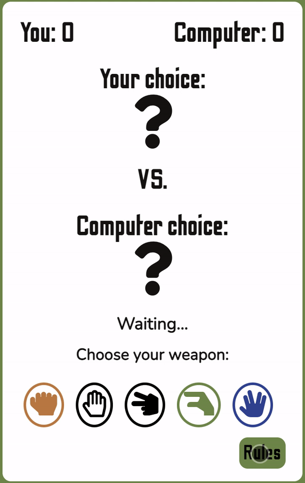

- Provide the player a popup containing the game rules to make them easy accessible from the game section.

### Result Section
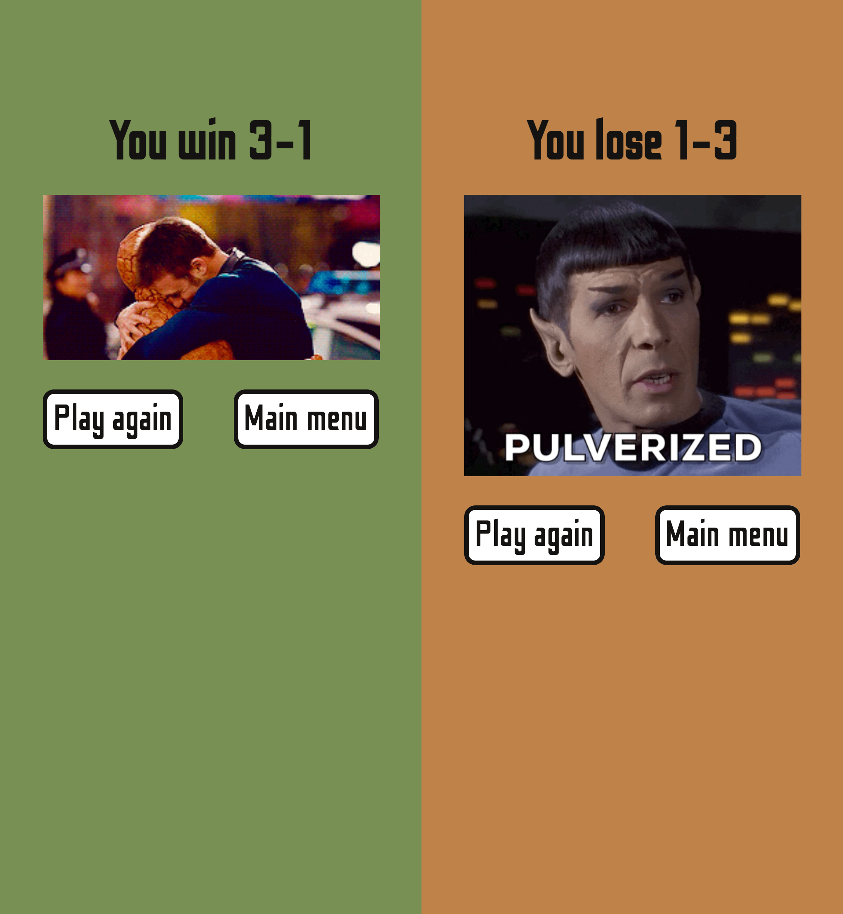

* The result section is an adaptable section that display the result of the game.

* **Result Title**
    - Displays the final score and if the player win or lose.

* **GIF Image**
    - Display a fun GIF that adapts depending on the game result.

* **Section Buttons**
    - The play again button close the result section to make the game available once again, clearing the last round.

    - The main menu button work as a link to the home section.

* **Section Background**
    - The background display different color depending on the game result to provide better feedback to the player.

### 404 Error Page
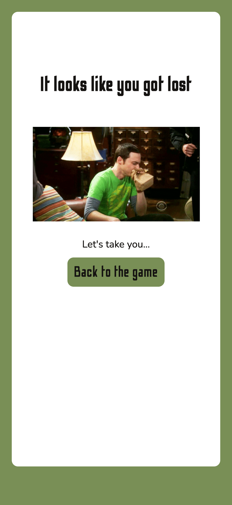

*  This single page is being shown in case the customer enters an incorrect address into the address bar. It contains a link to the home section.

[Back to top ⇧](#rpsls)

## Technologies Used

### Languages Used
* [HTML5](https://en.wikipedia.org/wiki/HTML5)
* [CSS3](https://en.wikipedia.org/wiki/CSS)
* [Javascript](https://en.wikipedia.org/wiki/JavaScript)

### Frameworks, Libraries and Programs Used

* [Google Fonts](https://fonts.google.com/)
    - Google Fonts was used to import the fonts Nunito and Odibee Sans into the style.css file. These fonts were used throughout the site.

* [Font Awesome](https://fontawesome.com/)
     - Font Awesome was used throughout all pages to add icons in order to create a better visual experience for UX purposes.

* [GitPod](https://gitpod.io/)
     - GitPod was used for writing code, committing, and then pushing to GitHub.

* [GitHub](https://github.com/)
     - GitHub was used to store the project after pushing.

* [Balsamiq](https://balsamiq.com/)
     - Balsamiq was used to create the wireframes during the design phase of the project.

* [Am I Responsive?](http://ami.responsivedesign.is/#)
    - Am I Responsive was used in order to see responsive design throughout the process and to generate mockup imagery to be used.

* [Responsive Design Checker](https://www.responsivedesignchecker.com/)
    - Responsive Design Checker was used in the testing process to check responsiveness on various devices.

* [Chrome DevTools](https://developer.chrome.com/docs/devtools/)
    - Chrome DevTools was used during development process for code review and to test responsiveness.

* [W3C Markup Validator](https://validator.w3.org/)
    - W3C Markup Validator was used to validate the HTML code.

* [W3C CSS Validator](https://jigsaw.w3.org/css-validator/)
    - W3C CSS Validator was used to validate the CSS code.

* [JSHint](https://jshint.com/) 
    - The JSHints JavaScript Code Quality Tool was used to validate the site's JavaScript code.

* [Favicon.cc](https://www.favicon.cc/) 
    - Favicon.cc was used to create the site favicon.

[Back to top ⇧](#rpsls)

## Testing

### Testing User Stories

* As a player, I want the game's website to be easy to navigate.

    - A carousel design has been implemented to move across the different sections with ease.

    - The website offers an intuitive structure for the player to find easily the information or section they are looking for.

    - The navigation bar is clearly presented to assist with the site's navigation.

* As a player, I want the game to be fun and engaging.

    - A fun main image has been selected to represent the game in a fun way.

    - The site's color design has been inspired on the main image in order to create a clear relation between each color used and the weapons available in the game.
    
    - The game area display the weapons chosen by both the player and the computer in their respective colors and icons.

    - The score for the current round is being tracked and displayed on the top of the game section.

    - Feedback area display the result for each round with a short explanation.

    - The game result is provided in a fun way with adaptable colors and GIFs depending on the result.

* As a player, I want to have easy access to the game rules.

    - A rules bottom is being provided directly on the game section.

    - The rules open on a popup directly on the game section so the player does not need to leave the game.

* As a player, I want the game controls to be easy to access during the game.

    - All the game buttons are being provided on the bottom of the game section for easy access.

* As a player, I want to receive overall feedback during and after the game.

    - Score for the current round is always available on the top of the game section.

    - The result for each round is being provided with a short explanation.

    - A clear game result gets displayed after the game.

* As a player, I want to be able to play the game on different devices.

    - Responsive design across all device sizes.

    ### Code Validation

* The [W3C Markup Validator](https://validator.w3.org/) and [W3C CSS Validator](https://jigsaw.w3.org/css-validator/) services were used to validate all pages of the project in order to ensure there were no syntax errors.

    - W3C Markup Validator returned a series of warnings concerning a possible misuse of aria-label. I considered this aria labels are being used to make available the icons in the rules popup available for the visually impaired.

    -  W3C CSS Validator found no errors or warnings on my CSS.

* The [JSHints JavaScript Code Quality Tool](https://jshint.com/) was used validate the site's JavaScript code.

    - JSHints found no errors on the site's JavaScript code.

### Accessibility

* Used Lighthouse in Chrome DevTools to confirm that the colors and fonts being used in throughout the website are easy to read and accessible.

* Lighthouse reports

    - **index.html**

    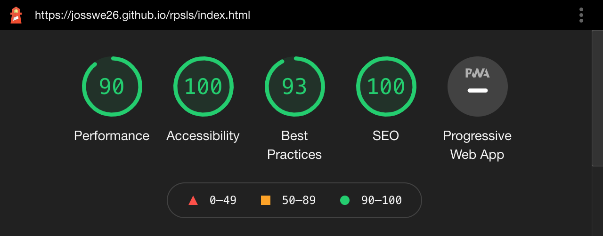

    - **404.html**

    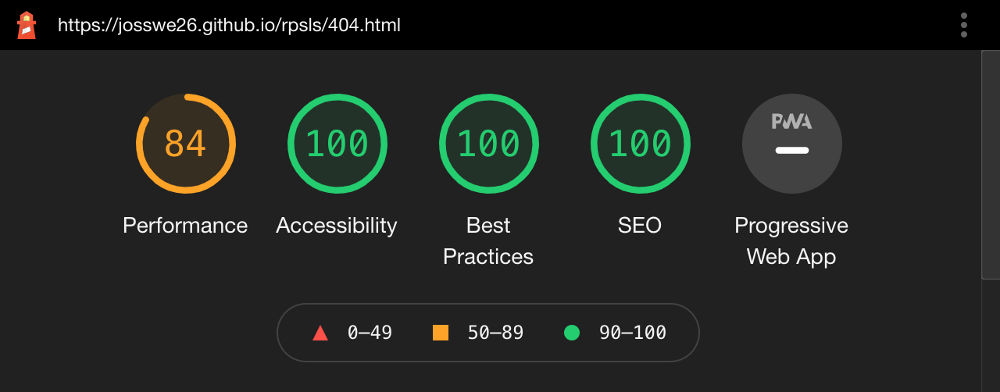

### Tools Testing

* [Chrome DevTools](https://developer.chrome.com/docs/devtools/)

    - Chrome DevTools was used during the development process to test, explore and modify HTML elements and CSS styles used in the project.

* Responsiveness

    - [Am I Responsive?](http://ami.responsivedesign.is/#) was used to check responsiveness of the site pages across different devices.

    - [Responsive Design Checker](https://www.responsivedesignchecker.com/) was used to check responsiveness of the site pages on different screen sizes.

    - Chrome DevTools was used to test responsiveness in different screen sizes during the development process.

### Manual Testing

* Browser Compatibility

Browser | Outcome | Pass/Fail  
--- | --- | ---
Google Chrome | No appearance, responsiveness nor functionality issues.| Pass
Safari | No appearance, responsiveness nor functionality issues. | Pass
Mozilla Firefox | Scrollbar is visible even though it should be hidden.  No responsiveness nor functionality issues.| Pass
Microsoft Edge | No appearance, responsiveness nor functionality issues. | Pass

**Comments:** Even thought the scrollbar is visible in Mozilla Firefox, the developer decided not to address this issue as the apappearance is not importantly affected.

* Device compatibility

Device | Outcome | Pass/Fail
--- | --- | ---
MacBook Pro 15" | No appearance, responsiveness nor functionality issues. | Pass
Dell Latitude 5300 | No appearance, responsiveness nor functionality issues. | Pass
iPad Pro 12.9" | No appearance, responsiveness nor functionality issues. | Pass
iPad Pro 10.5" | No appearance, responsiveness nor functionality issues. | Pass
iPhone XR | No appearance, responsiveness nor functionality issues. | Pass
iPhone 7 | No appearance, responsiveness nor functionality issues. | Pass

**Comments:** The landscape block mode gets activated on old devices due to their small screen size (eg. iPhone 4/3). The developer decided not to address this issue due to time constrains and the age of the devices being affected.

* Common Elements Testing

    - General

    Feature | Outcome | Pass/Fail
    --- | --- | ---
    Navigation Bar | Hover effect and links are working as expected. | Pass
    Carousel | Scroll and snapping functionality are working as expected | Pass
    Social Links | Open the specific website on a new tab. | Pass
    Wide screen background | Show video background on devices with screen 1024px and up. | Pass
    Landscape Orientation Blocker | Show full screen section when device is turned to landscape orientation. | Pass

    - Home Section
    
    Feature | Outcome | Pass/Fail
    --- | --- | ---
    Start Game Button | Hover effect work and link to game section when button is clicked work as expected. | Pass
    Feedback Button | Hover effect work as expected and open feedback form popup when clicked. | Pass
    
    - Feedback Form Popup
    
    Feature | Outcome | Pass/Fail
    --- | --- | ---
    Form | Require all fields in the right format before submission. |  Pass
    Send Feedback Button | Hover effect work as expected and submit form when cicked. |  Pass
    Close Button | Hover effect work as expected and close popup when clicked. | Pass

    - Game Section

    Feature | Outcome | Pass/Fail
    --- | --- | ---
    Player Score | Increase by 1 when player win round. |  Pass
    Computer Score | Increase by 1 when computer win round. |  Pass
    Player Icon | Display the weapon chosen by the player. | Pass
    Computer Icon | Display the weapon generated by the computer. | Pass
    Game Feedback | Display the expected text depending on the round result. | Pass
    Game Buttons | Clicking on each button select the correct weapon. | Pass
    Rules Button | Hover effect work as expected and open rules popup when clicked. | Pass
    Rules' Close Button | Hover effect work as expected and close popup when clicked. | Pass

    - Result Section

    Feature | Outcome | Pass/Fail
    --- | --- | ---
    Result Title | Display the expected text depending on the game result. | Pass
    GIF Image | Display expected GF image depending on the game result. | Pass
    Play Again Button | Hover effect work as expected and hide section when clicked. | Pass
    Main Menu Button | Hover effect work and link to home section when button is clicked work as expected. | Pass
    Section Background | | Display the expected color depending on the game result. | Pass

    - 404 Error Page

    Feature | Outcome | Pass/Fail
    --- | --- | ---
    404 Error Page | Entering an incorrect address into the address bar bring the player to the 404 error page. | Pass
    Back to the Game Button | Hover effect work and link to home section when button is clicked work as expected. | Pass

[Back to top ⇧](#rpsls)

## Finished Product

Page / Section | Image
--- | ---
Desktop Version | 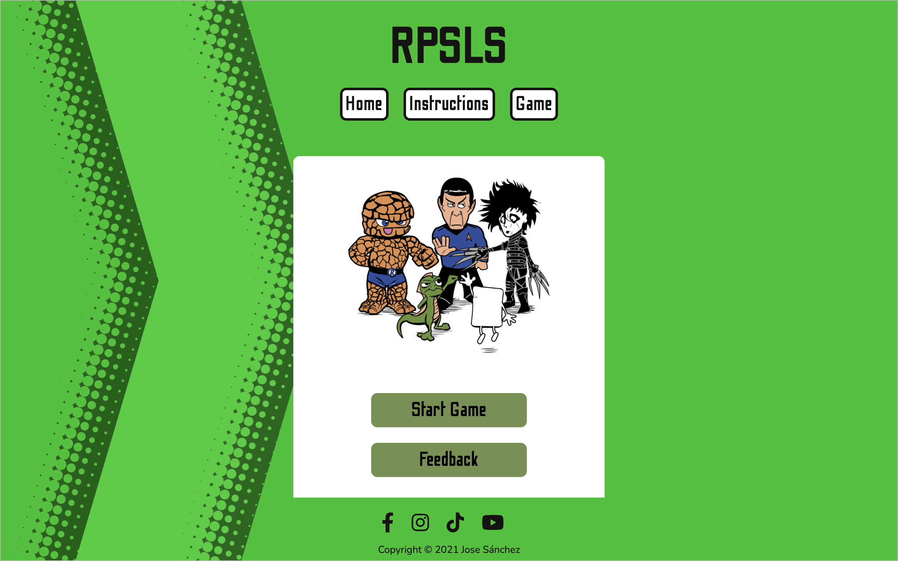
Home Section | 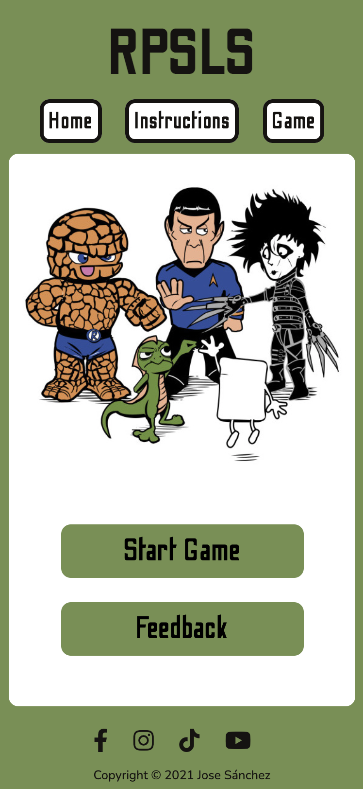
Feedback Popup | 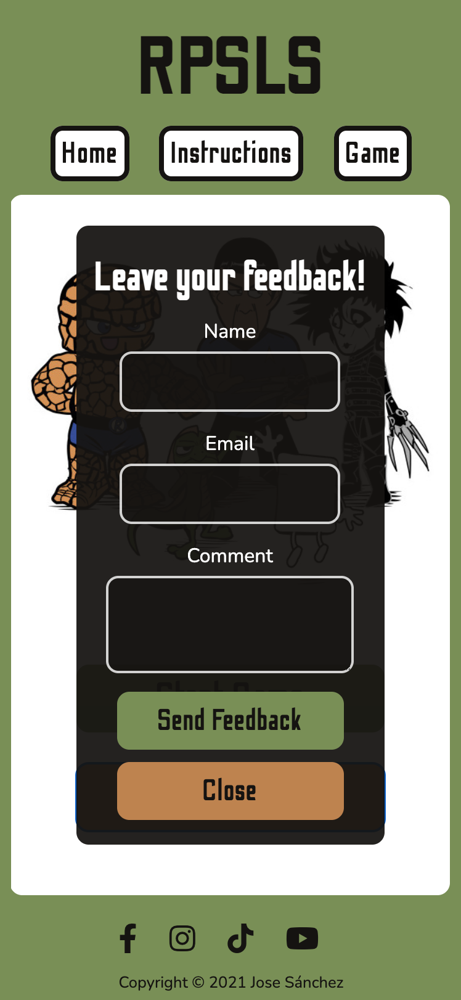
Instructions Section | 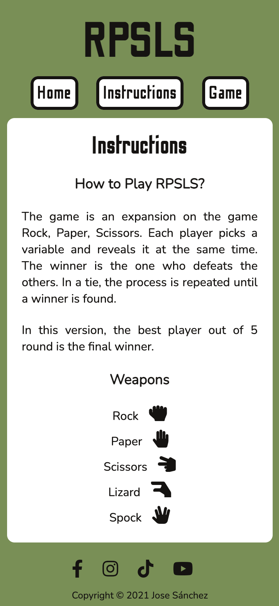
Game Section | 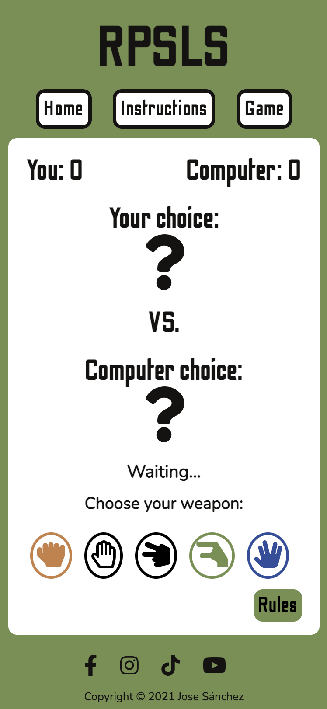
Rules Popup | 
Result Sections | 
Landscape Orientation Blocker | 
404 Error Page | 

[Back to top ⇧](#rpsls)

## Deployment

* This website was developed using [GitPod](https://www.gitpod.io/), which was then committed and pushed to GitHub using the GitPod terminal.

### GitHub Pages

* Here are the steps to deploy this website to GitHub Pages from its GitHub repository:

    1. Log in to GitHub and locate the [GitHub Repository](https://github.com/).

    2. At the top of the Repository, locate the Settings button on the menu.

        - Alternatively click [here](https://raw.githubusercontent.com/) for a GIF demostration of the process.

    3. Scroll down the Settings page until you locate the Pages section.

    4. Under Source, click the dropdown called None and select Master Branch.

    5. The page will refresh automatically and generate a link to your website.

[Back to top ⇧](#rpsls)

## Credits

### Content

* The instructions and rules were taken from the [Big Bang Theory Wiki](https://bigbangtheory.fandom.com/wiki/Rock,_Paper,_Scissors,_Lizard,_Spock).

### Media

* The main image was taken from [TeePublic](https://www.teepublic.com/t-shirt/17021-rock-paper-scissors) and was designed by [Samiel](https://www.teepublic.com/user/samiel).

* The GIF used in the 404 error page was taken from [GIPHY](https://giphy.com/gifs/paper-bag-breathing-aa9VQ6gg5wCBy).

* The background video was taken from [Pexels](https://www.pexels.com/video/arrow-shape-design-on-green-background-4665103/?utm_content=attributionCopyText&utm_medium=referral&utm_source=pexels) and was created by [Miguel Á. Padriñán](https://www.pexels.com/@padrinan?utm_content=attributionCopyText&utm_medium=referral&utm_source=pexels). 

### Code

* [Stack Overflow](https://stackoverflow.com/), [CSS-Tricks](https://css-tricks.com/) and [W3Schools](https://www.w3schools.com/) were consulted on a regular basis for inspiration and sometimes to be able to better understand the code being implement.

* The code for the carousel is a modified version of the CSS-Tricks code found [here](https://css-tricks.com/css-only-carousel/ ).

* The code for the popups is a modified version of the W3Schools code found [here](https://www.w3schools.com/howto/howto_js_popup_form.asp).

* The code to apply the full screen background was found at [CSS-Tricks](https://css-tricks.com/full-page-background-video-styles/).

[Back to top ⇧](#rpsls)

## Acknowledgements

* My partner, for her unconditional love, help and continued support in all aspects of life to make possible for me to complete this project.

* My family, for their valuable opinions, critics and support during the design and development process.

* My tutor, Marcel, for his invaluable feedback and guidance.

* My friend, Miguel, for all the late calls, support and ideas that made me challenge myself.

* Code Institute and its amazing Slack community for their support and providing me with the necessary knowledge to complete this project.

[Back to top ⇧](#rpsls)